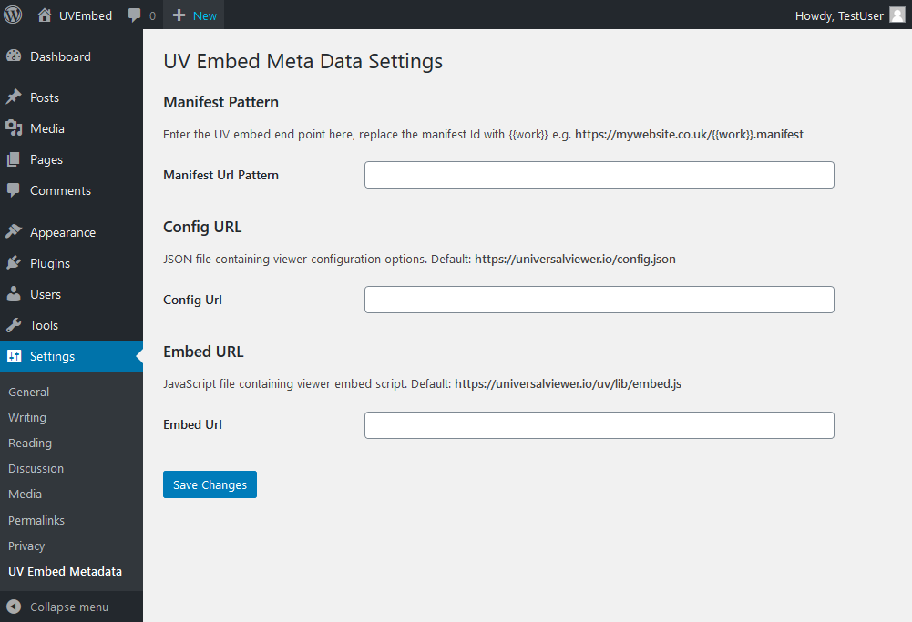

# UVembed metadata

Contributors: Hannah Nicholas  
Tags:  
Requires at least: 4.0.0  
Tested up to: 5.3  
Stable tag: 1.0.3
License: GPLv3 or later  
License URI: http://www.gnu.org/licenses/gpl-3.0.html

## Description

A wordpress plugin incorporating the UVEmbed short code and the ability to search for included images via search using additional meta data custom fields.

## Usage

Update the endpoint configuration in "Settings > UV Embed Metadata" and the plugin should do the rest.

To embed the UniversalViewer on a page use the `[uvembed]` shortcode. This takes a single "work" parameter which is combined with the "Manifest URL Pattern" setting to generate the final manifest location.

For example,

- "Manifest URL Pattern": `https://uv-embed.com/manifest/{{work}}.json`
- Shortcode: `[uvembed work="ABC-123"]`
- Final manifest URL: `https://uv-embed.com/manifest/ABC-123.json`

## Installation

1. Upload the ZIP file through the "Plugins > Add New > Upload" screen in your WordPress dashboard.
1. Activate the plugin through the 'Plugins' menu in WordPress
1. Visit the settings screen and configure, as desired.

## Scripts

Use `scripts\createzip.sh` to generate ZIP file containing required files.

## Frequently Asked Questions

# How do I contribute?

We encourage everyone to contribute their ideas, thoughts and code snippets. This can be done by forking the [repository over at GitHub](http://github.com/digirati-co-uk/uvembed-metadata/).

## Screenshots

1. The settings screen.

## Upgrade Notice

### 1.0.3

- 2020-01-31
- Update readme and help text.

### 1.0.2

- 2017-04-01
- Fixed bug which prevented tag page displaying posts

### 1.0.1

- 2016-11-02
- Added ability to update all urls in shortcode through settings.

### 1.0.0

- 2016-08-15
- Initial release.

## Changelog

### 1.0.0

- 2016-08-15
- Initial release.
